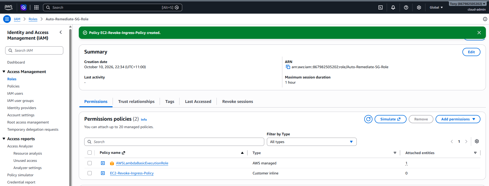
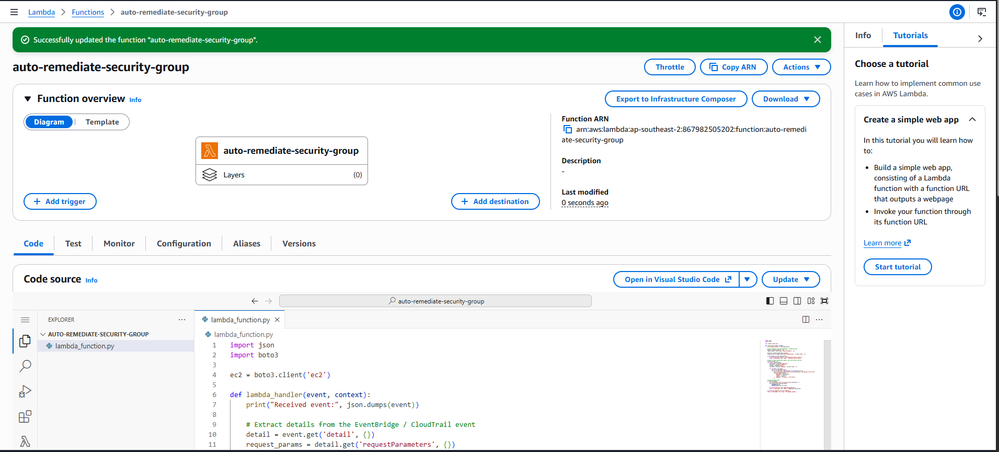
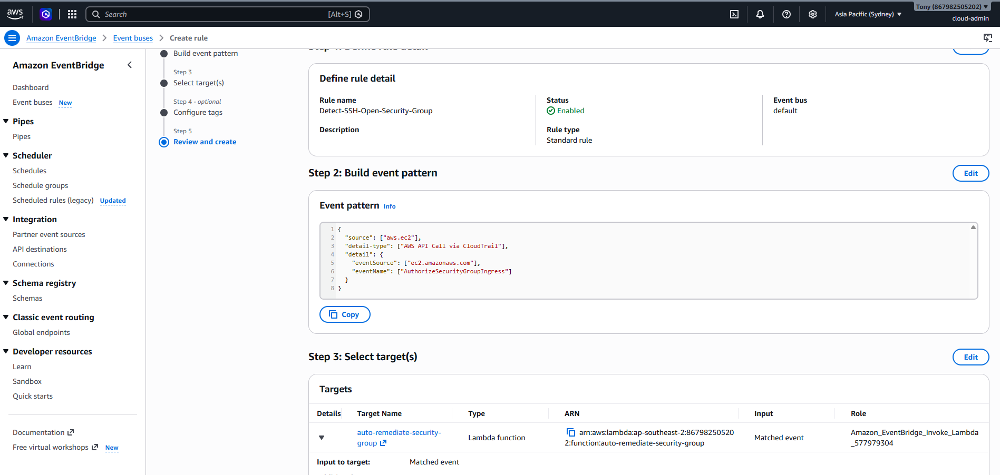
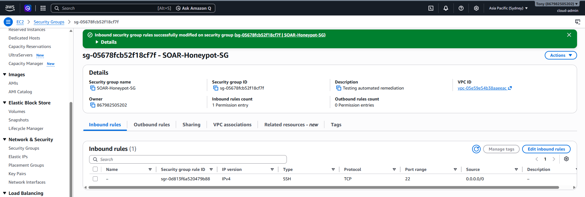
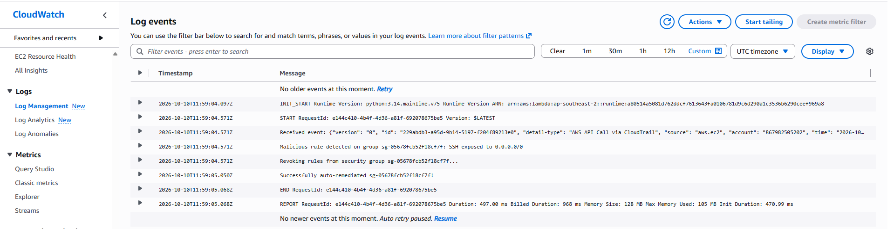

# Cloud Security Incident Response & SOAR: Automated Threat Remediation

## 🎯 Executive Summary
In modern enterprise cloud environments, relying on manual triage for critical infrastructure misconfigurations leaves dangerous windows of exposure. This project implements a real-time, event-driven Security Orchestration, Automation, and Response (SOAR) pipeline within Amazon Web Services (AWS) using Free Tier services.

The system continuously audits control-plane management telemetry using **AWS CloudTrail**, routes unauthorized firewall modifications via **Amazon EventBridge**, and autonomously executes containment using an **AWS Lambda** script written in Python (`boto3`). During validation, an unauthorized modification exposing TCP Port 22 (SSH) to `0.0.0.0/0` was detected, evaluated, and programmatically revoked without human intervention.

---

## ☁️ Cloud Architecture & Threat Modeling

```text
               [ Threat Actor / Admin Misconfiguration ]
                                   │
                                   ▼
                       [ EC2 Security Group ]
            (Unauthorized Rule: Port 22 / 0.0.0.0/0)
                                   │
                                   ▼
                         [ AWS CloudTrail ]
          (Captures AuthorizeSecurityGroupIngress API Call)
                                   │
                                   ▼
                       [ Amazon EventBridge ]
                 (Custom CloudTrail Event Pattern)
                                   │
                                   ▼
                     [ AWS Lambda Responder ]
              (Parses Payload & Executes Boto3 Script)
                                   │
                  ┌────────────────┴────────────────┐
                  ▼                                 ▼
      [ Programmatic Remediation ]       [ Amazon CloudWatch ]
   (ec2.revoke_security_group_ingress)     (Forensic Audit Trail)
```

### Infrastructure & Engineering Stack

| Metric / Layer | Implementation Details |
| :--- | :--- |
| **Cloud Provider** | Amazon Web Services (AWS) |
| **Target Service** | Amazon EC2 (Elastic Compute Cloud) - Security Groups |
| **Telemetry Sensor** | AWS CloudTrail (`ap-southeast-2`) |
| **Event Router** | Amazon EventBridge (Default Event Bus) |
| **Remediation Engine** | AWS Lambda (Python 3.x Runtime via `boto3`) |
| **Access Control** | AWS IAM (Principle of Least Privilege inline role) |
| **Forensic Logging** | Amazon CloudWatch Logs |

---

## 🛠️ Step-by-Step Implementation & Configuration

### 1. Principle of Least Privilege: IAM Role Setup
To prevent privilege creep and adhere strictly to least-privilege access principles, a custom IAM execution role was created specifically for the automated responder:

* **Role Name:** `Auto-Remediate-SG-Role`[cite: 10]
* **Managed Policy:** `AWSLambdaBasicExecutionRole` (Grants scoped permissions to write execution logs to CloudWatch)[cite: 10]
* **Inline Policy (`EC2-Revoke-Ingress-Policy`):** Grants explicit authorization to inspect and remove security group ingress rules while denying broader administrative permissions[cite: 10]:
  ```json
  {
      "Version": "2012-10-17",
      "Statement": [
          {
              "Sid": "AllowRevokeSecurityGroupIngress",
              "Effect": "Allow",
              "Action": [
                  "ec2:RevokeSecurityGroupIngress",
                  "ec2:DescribeSecurityGroups"
              ],
              "Resource": "*"
          }
      ]
  }
  ```



---

### 2. Remediation Engine: AWS Lambda Function
A serverless Python function (`auto-remediate-security-group`) was authored and deployed to process incoming JSON payloads from the event bus[cite: 11]:

* **Runtime:** Python 3.x[cite: 11]
* **Handler Logic:**
  1. Ingests raw EventBridge event payloads containing CloudTrail metadata.
  2. Parses `requestParameters` to isolate the target `groupId` and evaluates `ipPermissions` arrays.
  3. Scans for high-risk configurations matching `FromPort: 22`, `ToPort: 22`, and `CidrIp: 0.0.0.0/0`.
  4. Calls `ec2.revoke_security_group_ingress` with the targeted parameters to strip the malicious permission immediately.



---

### 3. Event Router: Amazon EventBridge Configuration
An event pattern rule (`Detect-SSH-Open-Security-Group`) was provisioned on the `default` event bus to monitor real-time API activity[cite: 8]:

* **Event Source:** `aws.ec2`[cite: 8]
* **Detail Type:** `AWS API Call via CloudTrail`[cite: 8]
* **Event Name:** `AuthorizeSecurityGroupIngress`[cite: 8]
* **Target:** `auto-remediate-security-group` (AWS Lambda)[cite: 8]

#### Custom Event Pattern
```json
{
  "source": ["aws.ec2"],
  "detail-type": ["AWS API Call via CloudTrail"],
  "detail": {
    "eventSource": ["ec2.amazonaws.com"],
    "eventName": ["AuthorizeSecurityGroupIngress"]
  }
}
```



---

## 🧪 Threat Simulation & Forensic Verification

### 1. Attack Vector Injection: Malicious Ingress Rule
To simulate an insider threat or accidental administrative misconfiguration:
* A target security group (`SOAR-Honeypot-SG`) was created[cite: 12].
* An ingress rule was injected opening TCP Port 22 (SSH) to `0.0.0.0/0`, exposing the cloud perimeter to arbitrary external access and brute-force vectors[cite: 12].



---

### 2. Autonomous Containment & Verification
Once the `AuthorizeSecurityGroupIngress` API call was processed:
1. EventBridge triggered the Lambda responder within seconds.
2. The Lambda function inspected the rule parameters, matched the non-compliant SSH CIDR block, and issued a programmatic revocation.
3. Upon refreshing the AWS Management Console, the inbound rule for `SOAR-Honeypot-SG` was completely wiped, returning the inbound rule count to zero without manual intervention.

---

### 3. Log Analysis & Audit Trail (Amazon CloudWatch)
The execution stream in CloudWatch (`/aws/lambda/auto-remediate-security-group`) recorded the complete detection and remediation lifecycle[cite: 9]:

* **Event Ingestion:** Intercepted API call initiated within the account[cite: 9].
* **Rule Identification:** Identified rule targeting security group `sg-05678fcb52f18cf7f` with SSH exposed to `0.0.0.0/0`[cite: 9].
* **Programmatic Revocation:** Successfully dispatched `RevokeSecurityGroupIngress` command[cite: 9].
* **Execution Metric:** Execution completed with status `200 OK` in under 500 ms of compute time[cite: 9].



---

## 🛡️ Key Takeaways & Enterprise Security Impact

1. **Dramatic Reduction in MTTR:** Decreased Mean Time to Remediate from hours of standard analyst triage down to automated execution within seconds of log ingestion.
2. **Defensive Posture Hardening:** Demonstrates how event-driven automation neutralizes cloud attack surfaces before automated threat scanners can discover exposed management ports.
3. **Zero Infrastructure Cost:** Leverages serverless architectures that operate fully within the AWS Free Tier, providing high operational security with zero compute overhead when idle.
