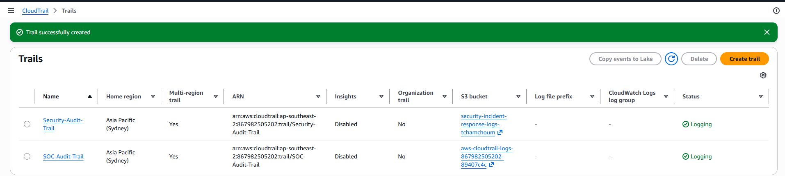
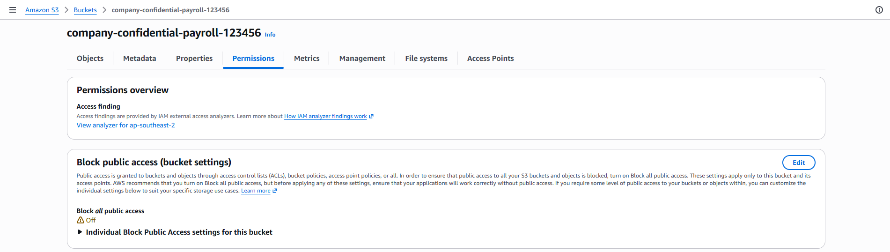
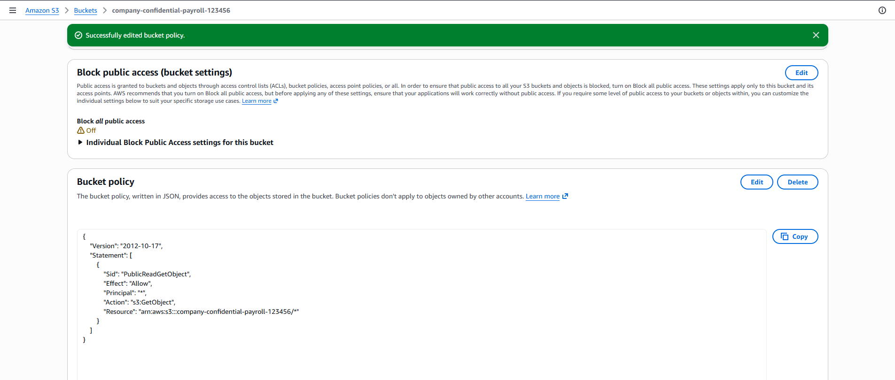
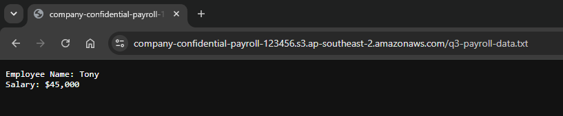
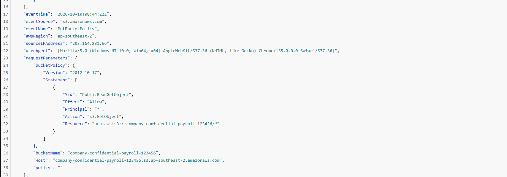

# Cloud Security Incident Response: Public S3 Data Exfiltration

## 🎯 Executive Summary
During routine cloud monitoring of the AWS environment, an unauthorized data exfiltration event was detected originating from a public-facing Amazon S3 bucket. 

The incident was identified as a critical misconfiguration where a storage bucket containing sensitive payroll data was stripped of its "Block Public Access" protections and assigned a wildcard read policy. This report details the timeline of the misconfiguration, the exfiltration vector, and the CloudTrail forensic artifacts used to track the event.

---

## ☁️ Cloud Environment & Asset Profiling

| Metric | Asset Details |
| :--- | :--- |
| **Cloud Provider** | Amazon Web Services (AWS) |
| **Compromised Service** | Amazon S3 (Simple Storage Service) |
| **Bucket Name** | `company-confidential-payroll-123456` |
| **Region** | `ap-southeast-2` |
| **Exfiltrated Data** | `q3-payroll-data.txt` |

### Forensic Verification & Setup

#### 1. Audit Trail Verification
Prior to the incident, AWS CloudTrail was properly configured to log all management events to a secure, isolated S3 bucket, ensuring a tamper-proof record of API calls.

#### 2. The Vulnerability (Public Access Misconfiguration)
The root cause of the exposure was the manual disabling of the **Block all public access** security feature at the bucket level, overriding the AWS default safety mechanisms.

---

## 🔍 Attack Vector & Technical Analysis

### 1. Policy Manipulation (`PutBucketPolicy`)
Following the removal of public access blocks, a highly permissive bucket policy was applied. CloudTrail logs captured a `PutBucketPolicy` API call injecting the following statement:
* **Effect:** `Allow`
* **Principal:** `*` (Any unauthenticated internet user)
* **Action:** `s3:GetObject`

### 2. Unauthenticated Data Exfiltration
With the wildcard policy active, an external threat actor was able to query the S3 endpoint directly via a standard web browser. The sensitive file `q3-payroll-data.txt` was successfully downloaded without requiring any IAM authentication or access keys.

### 3. Threat Hunting & Log Analysis
By querying the CloudTrail Event History for the specific resource name, the exact timestamp and origin of the misconfiguration were identified. The raw JSON event record confirmed the source IP address (`203.164.231.56`) responsible for the `PutBucketPolicy` execution.

---

## 🛡️ Remediation & Containment Actions

1. **Immediate Isolation:** Re-enabled the **Block all public access** setting on the affected S3 bucket via the AWS Management Console to immediately terminate all unauthorized external connections.
2. **Policy Rollback:** Deleted the permissive wildcard bucket policy, restricting access solely to authorized IAM roles.
3. **Access Key Rotation:** Though this was an unauthenticated attack, best practice dictates identifying the IAM user who executed the `PutBucketPolicy` call and rotating their access keys to prevent further misconfigurations.
4. **Data Event Logging:** Upgraded CloudTrail to log S3 **Data Events** (Object-level API activity) to determine exactly how many external IP addresses downloaded the `q3-payroll-data.txt` file during the exposure window.
